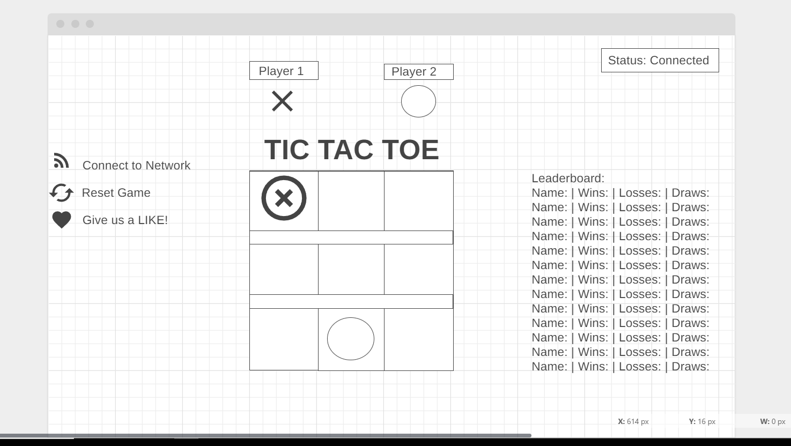
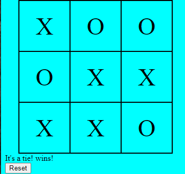
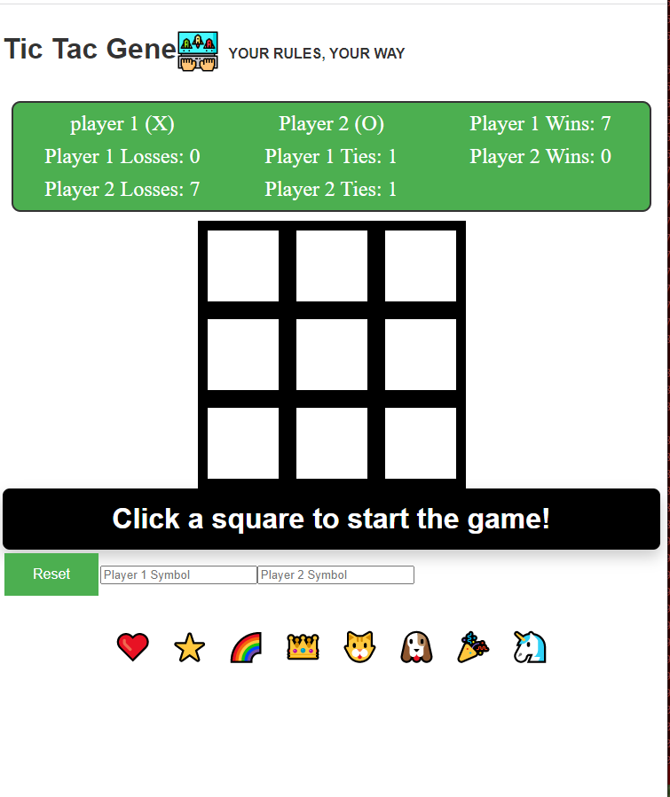

# Tic Tac Toe Game

## Description
This is a simple implementation of a Tic Tac Toe game. The game can be played by two players, with Player 1 taking X's and Player 2 taking O's. The game is played on a 3x3 grid.

## Table of Contents
* Wireframe
* Installation
* Usage
* User Stories
* User Stories - Psuedo Logic
* Psuedo Logic

## Wireframe


## Bronze MVP


## Silver MVP


## Installation

To use this Tic Tac Toe game, simply download the files or clone the repository to your local machine.

## Usage

To start a new game, open the index.html file in your web browser. The game board will be displayed on the page.

Click on any square to place your X or O. The game will automatically switch between Player 1 and Player 2.

After each turn, a message will be displayed to indicate if someone has won, lost, or tied. The game will also display whose turn it is next.

If you try to click on a square that has already been played, you will receive an error message and will not be able to make the move.

Once the game is over, you can play again by clicking the "Play Again" button.

## User Stories

* As a user, I should be able to start a new tic tac toe game
* As a user, I should be able to click on a square to add X first and then O, and so on
* As a user, I should be shown a message after each turn for if I win, lose, tie or who's turn it is next
* As a user, I should not be able to click the same square twice
* As a user, I should be shown a message when I win, lose or tie
* As a user, I should not be able to continue playing once I win, lose, or tie
* As a user, I should be able to play the game again without refreshing the page

## User Stories - Psuedo Logic
```
* Start game > Click Button 
* First Turn > Event Listener > Square(Div)
*   forEach Turn, Func CheckWin, print message(win, lose, tie, current turn)
    * If Square, has already been clicked, remove event listner from square[index]
    * func checkWin > print win, lose, tie
    * If GameOver === true, remove event listener from all squares or render unclickable.
        print must reset game
* reset game > ButtonClick > StartNewGame()
```

## Psuedo Logic

The game logic is based on the following psuedo code:
```
// Render the game board
// Create a 3x3 grid of divs and append them to the DOM
// Add a click event listener to each cell to handle player moves

// Initialize player symbols and positions
// let player1Symbol = 'X'
// let player2Symbol = 'O'
// let player1Positions = []
// let player2Positions = []

* get each spot in the grid.
    * grid = array of divs
    * loop through array to track each position on the board
* Set conditions for winning
    * If player1 positions
        * 3 x's in a row
        * In any direction
        * player1 Wins
    * Else if player2 positions
        * 3 o's in a row
        * in any direction
        * player 2 wins

// Game logic - Detailed
// When a player clicks a cell, add their position to their respective array
// Check if the player has won by comparing their positions to winning combinations
    // If the player has won, display a message and end the game
// If the board is full and no player has won, display a tie message and end the game
// If the game has not ended, switch to the other player's turn and continue playing

// Set conditions for winning
// Winning combinations:
    // Row 1: [0, 1, 2]
    // Row 2: [3, 4, 5]
    // Row 3: [6, 7, 8]
    // Column 1: [0, 3, 6]
    // Column 2: [1, 4, 7]
    // Column 3: [2, 5, 8]
    // Diagonal 1: [0, 4, 8]
    // Diagonal 2: [2, 4, 6]
    // To check for a win, compare the player's positions to each of these combinations
    // If the player's positions match a winning combination, they have won

```

## Technologies Used 
* HTML / CSS / Javascript